# Звіт до роботи
## Тема: робота в віртуальних середовищах
### Мета роботи: навичитись працювати в віртульних середовищах 

---
### Виконання роботи
1. Подивився які команди виконує pip та які бібліотеки вже встановленні на комп'ютері
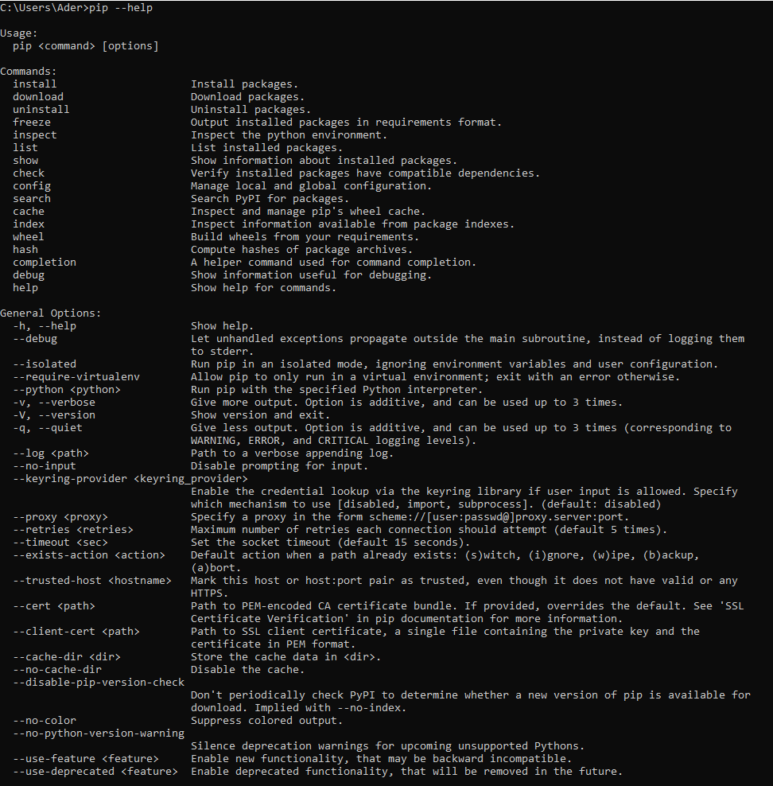
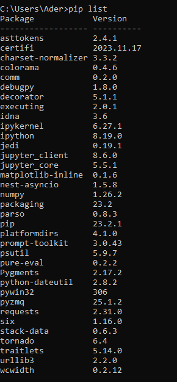

2. Встановив бібліотеку requests за допомогою pip install та виконав кілька команд з бібоіотеки в консолі
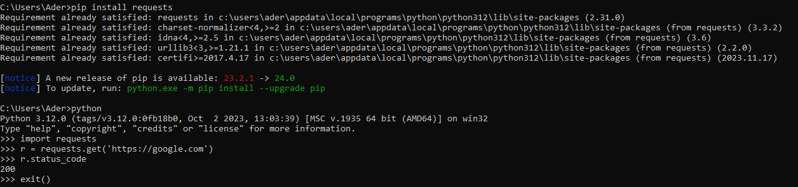
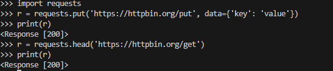

3. Перевстановив бібліотеку request на версію 2.1. Видалив бібліотеку за допомогою uninstall
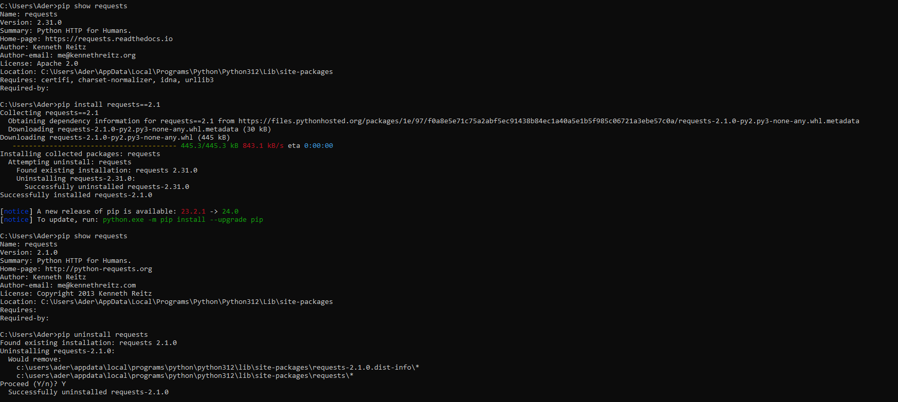

4. Створив нове віртуальне середовище my_env. Встановив в ньому бібіліотеку requests, тоді вийшов з вітруального середовища
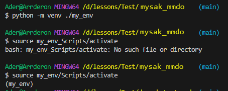
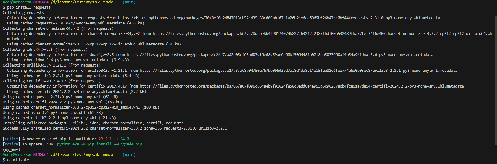

Команда "pip show requests" видає попередження про те що бібліотека request не встановлена. Це відбувається через те, що минулою командою "deactivate" ми вийшли з віртуального середовища в глобальне, в якому бібліотека не встановлена.
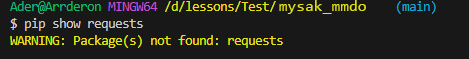

5. Створив файл .gitignore в якому вказав файли які не потрібно комітити в репозиторій.

6. Встановив pipenv. Переглянув список команд pipenv за допомогою інструкції --help.
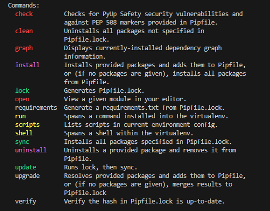

7. Створив нове віртуальне середовище та встановив в нього бібліотеку requests використовуючи pipenv. Переконався що в мене створились файли Pipfile та Pipfile.lock в яких знаходяться налаштування віртуального середовиза та версії бібліотек які в ньому встановлені.
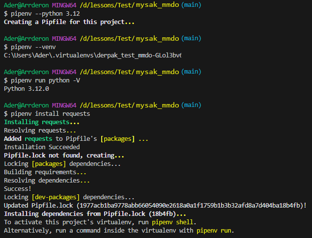

8. Створив новий new.py файл з наступним кодом:

```python
import requests

response = requests.get('https://httpbin.org/')
for line in response.iter_lines():
    print(line)
```

При запуску з Visual Studio або з консолі інтерпритатор видає помилку "ModuleNotFoundError: No module named 'requests'". При запуску коду  з нового віртульного середовища отримуєм результат програми. Результат програми записаний в файлі result.txt.

9. Інсталював бібліотеку pandas в віртульне середовище. Створив файл pandasExample.py з наступним кодом:

```python
import pandas as pd

a = pd.DataFrame({'A': [1, 2, 3]})
print(a)
```

Змінив python інтерпритарор в Visual Studio та запустив код. Результати:
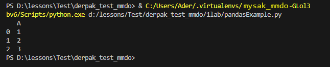 

10. Створив .env файл. Створив файл envVar.py з кодом:

```python
import os
env_var = os.environ
print(env_var)
```

Результат роботи програми:
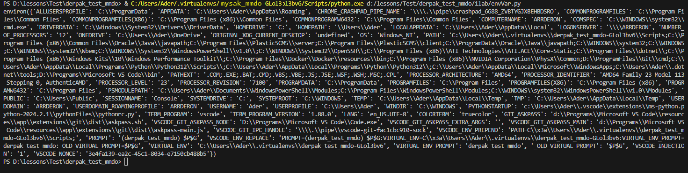

11. Створив сайт на Flask на якому відображається таблиця зроблена з використанням pandas.
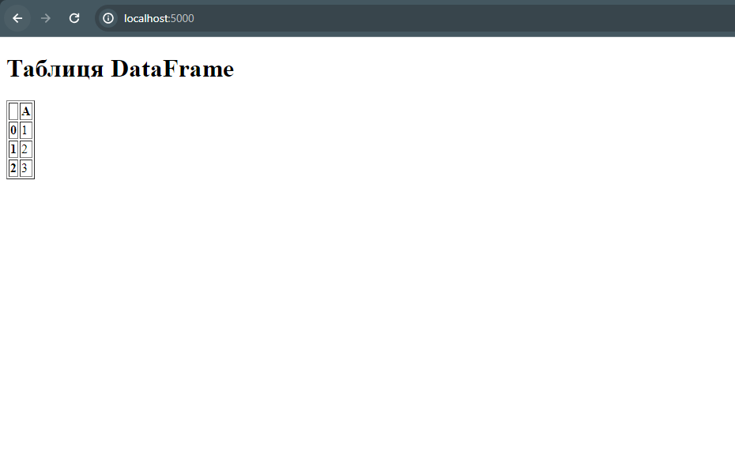

---
### Висновок:
#### Під час виконання даної роботи я навчився працювати з віртуальними середовищами, встановлювати бібліотеки інструментом pip, та користуватись python бібліотекою pipenv. 

---