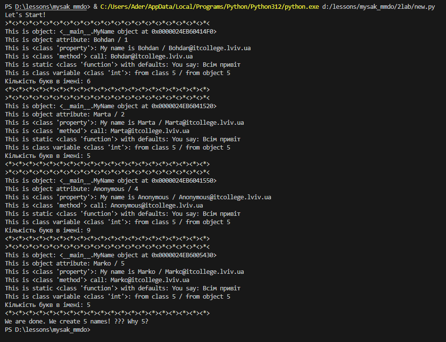

# Звіт до роботи

## Тема: Знайомство з ООП

### Мета роботи: навичитись працювати з класами в Python

---

### Виконання роботи

Створив файл new.py та скопіював в нього вказаний в завдані код. Додав своє ім'я в список. Запустив код і отримав результат:



**Відповіді на запитання:**

- Чому коли передаємо значення None створюється обєкт з іменем Anonymous?

За призначення ім'я об'єкту відповідає стрічка коду:
```python
self.name = name if name is not None else self.anonymous_user().name
```
Якщо ім'я в списку дорівнює None тоді для об'єкта присвоюється ім'я яке повертає метод anonymous_user(), тобто в нашому випадку "Anonymous"

-  Як змінити текст привітання при виклику методу say_hello()?

Для того щоб задати текст привітання під час виклику методу потрібно змінити параметр методу. Параметр message автоматично задається значення "Hello to everyone!". Щоб цього уникнути можна змінити опис методу з.

```python
say_hello(message="Hello to everyone!")
```

на

```python
say_hello(message)
```

Тоді при виклику методу можна задавати користувацьке привітання:

```python
say_hello("Всім привіт!")
```

- Функція в класі яка порахує кількість букв в імені.

Функцію для підрахунку букв в імені можна записати так:

```python
def calculate_len(self):
        return len(self.name)
```

- Чому маємо різну кількість імен?

Коли ми намагаємося створити "Анонімний" об'єкт наша програма хоче призначити йому ім'я в стрічці коду:

```python
self.name = name if name is not None else self.anonymous_user().name
```

але наш метод anonymous_user() повертає не анонімне ім'я а клас MyName. І коли програма намагається взяти ім'я з цього класу вона запускає init метод, в якому збільшує рахунок всіх імен на одиницю.


---

### Висновок

#### Під час виконання даної роботи я навчився працювати з віртуальними середовищами, встановлювати бібліотеки інструментом pip, та користуватись python бібліотекою pipenv

---
