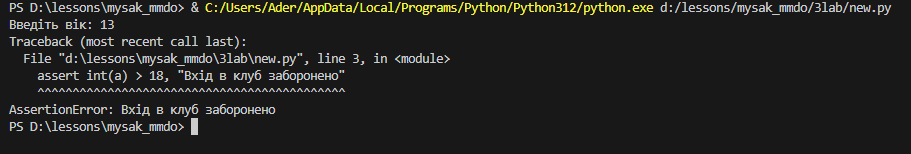
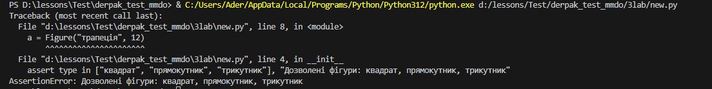
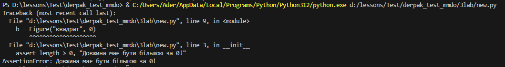
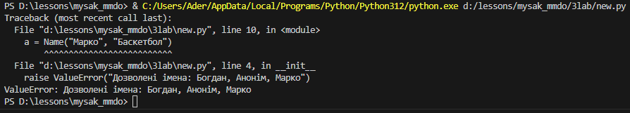
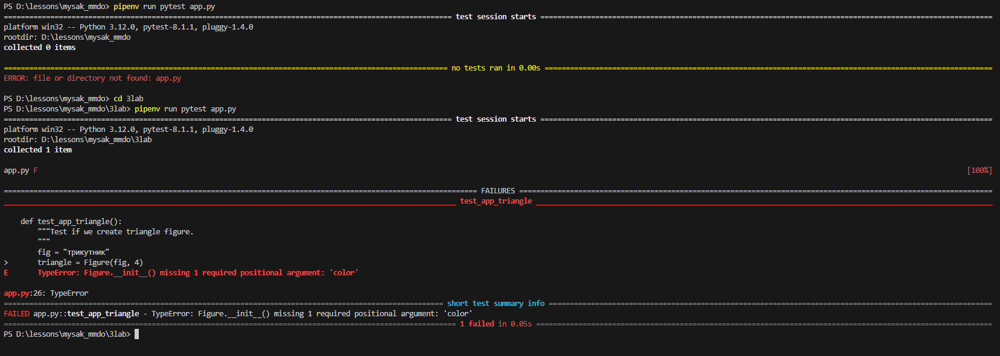
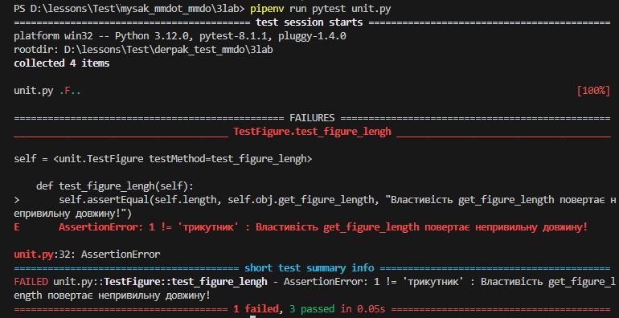
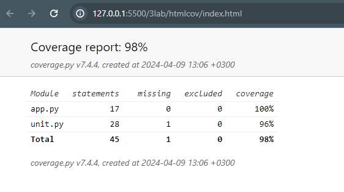

# Звіт до роботи

## Тема: Написання Тестів

### Мета роботи: навичитись створювати тести на мові програмування Python

---

### Виконання роботи

1. Створив new.py файл та написав простий приклад тесту з використанням assert. 

```python
a = input("Введіть вік: ")
assert a.isdigit(), "Потрібно ввести число"
assert int(a) > 18, "Вхід в клуб заборонено" 
```

Результат виконання:



2. Виконав код наведениий в завданні для різних об'єктів. Результати:




3.  Додав власне імя в перевірку, та спробував створити такий обєкт. Додав ще один аргумент в клас, та перевірку чи він не пустий

```python
class Name:
    def __init__(self, name, hobby) -> None:
        if name not in ["Богдан", "Анонім", "Марко"]:
            raise ValueError("Дозволені імена: Богдан, Анонім, Марко")
        self.name = name

        if hobby == "":
            raise ValueError("Хобі не введено")

a = Name("Марко", "Баскетбол")
```

Результат:


4. Скрпіював вказані в завданні тести в `unit.py`, запустив виконання тестів. Запускаються 3 тести. Перевірка типу фігури і об'єкту проходять успішно, а перевірка довжини провалюється.

5. Додав до класу класу який перевіряється властивіть `get_color`, яка повертає колір фігури. 

```python
@property
def get_color(self):
    return self.color
```

В тестах написав перевірку для доданої властивості:

```python
def test_figure_color(self):
        self.assertEqual(self.color, self.obj.get_color, "Властивість get_color повертає неправильний колір!")
```

6. Створив віртуальне середовище і інсталював в нього бібліотеку `PyTest`. Додав тест `test_app_triangle` в `app.py`. Запустив тест командою:

```bash
pipenv run pytest app.py
```

При запуску новий тест не виконався:


Викликав всі тести з файлу `unit.py` командою:

```bash
pipenv run pytest test.py
```

Результат запуску тестів:


7. Встановив бібліотеку `coverage` та згенерував звіт про покриття тестів у форматі html.



---

### Висновок

#### Під час виконання даної роботи я навчився створювати та працювати з тестами на мові програмування Python. Дізнався про візуалізацію тестів та бібліотеку coverage.

---
